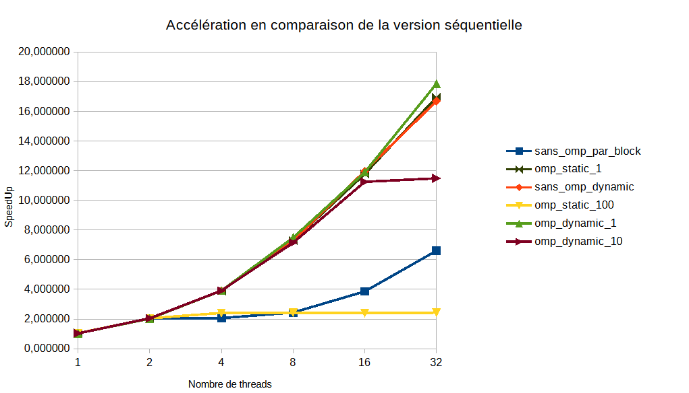

# Compte Rendu des performances : Calcul de Mandelbrot

## Introduction et Méthodologie

### Objectif du TP

L'objectif de ce travail est d'étudier les mécanismes de parallélisation sous OpenMP et d'analyser leur impact sur les performances. Nous nous sommes concentrés ici sur la fractale de Mandelbrot.

Contrairement à des algorithmes simples, le calcul de cette fractale présente une charge de travail très hétérogène et irrégulière. Le calcul exécuté pour chaque pixel (point  du plan complexe) consiste à itérer la suite  en partant de . La boucle s'arrête soit quand le module  dépasse 2 (le point diverge rapidement et appartient aux bords), soit quand on atteint l'itération maximale  (le point appartient à la zone noire centrale). C'est cette condition d'arrêt variable qui provoque un déséquilibre massif du temps de calcul entre les différents pixels.

### Environnement et Méthodologie

Les mesures ont été effectuées sur l'infrastructure Grid5000.
Cette contrainte matérielle est importante car les processeurs utilisés possèdent 18 cœurs physiques et 36 threads logiques. C'est pour cela que nous avons pu faire des mesures jusqu'à 32 threads. La compilation a été réalisée avec `gcc` (options `-fopenmp` et `-lm`), sans flag d'optimisation agressif tel que `-O3`.

Pour chaque version (Séquentielle, Parallélisation manuelle, OpenMP Static/Dynamic), nous avons mesuré le temps d'exécution et calculé le *Speedup*. L'analyse se concentre sur l'identification des goulots d'étranglement, et surtout, la répartition de la charge de travail. Pour garantir la fiabilité des données, tous les calculs de temps ont été effectués 3 fois et la moyenne a été retenue afin d'éviter les erreurs de mesure. L'ensemble des valeurs brutes est situé dans le fichier [donnees.ods](https://www.google.com/search?q=donnees.ods).

## Analyse des performances : Calcul de Mandelbrot

Le calcul de Mandelbrot est dominé par une contrainte algorithmique majeure : l'irrégularité de la charge de travail.

#### 1. Analyse du début de parallélisation (2 Threads)

Contrairement au calcul de Pi où l'on voyait déjà des divergences, ici le passage à 2 threads est très efficace quelle que soit la version (**~2.02**). Cela signifie que le calcul va plus de 2 fois plus vite avec 2 threads qu'avec 1 seul. Cette particularité (qui n'est présente que pour 2 threads) s'appelle un speedup super-linéaire.

Cela s'explique par la nature du problème : la complexité arithmétique ("lourdeur" du calcul) masque totalement le surcoût de gestion des threads. De plus, l'utilisation de deux cœurs permet de doubler la quantité de mémoire cache L1/L2 disponible, accélérant le traitement au-delà de la simple puissance de calcul brute. Enfin, la symétrie de la fractale fait qu'avec 2 threads divisant l'image en deux (haut/bas), la charge est naturellement et parfaitement équilibrée.

#### 2. Analyse de la version "Par Bloc" (Sans scheduler)

Les performances stagnent, voire s'effondrent, entre 4 et 8 threads. C'est un problème critique de répartition des tâches :

* La complexité de Mandelbrot est concentrée au centre de l'image (zone noire où  est atteint).
* Avec un découpage par gros blocs contigus, certains threads héritent de cette zone très coûteuse pendant que les autres traitent les bords (rapides) et finissent quasi instantanément.
* **Le goulot d'étranglement :** À 8 threads, le problème est accentué : seuls 2 threads travaillent réellement sur la zone difficile. Les 6 autres attendent. Le temps global est donc dicté par ces 2 threads surchargés. Le speedup ne remonte qu'à 16/32 threads (**~6.3**) car les blocs deviennent enfin assez petits pour diviser un peu mieux cette zone centrale.

#### 3. Comparaison des stratégies de scheduling OpenMP

* **Schedule `Static, 100` (Problème de granularité) :**
C'est la stratégie qui subit le plus la difficulté du calcul. Avec 800 lignes et un *chunk* de 100, il n'y a que 8 tâches à distribuer au total.
Dès que l'on dépasse 8 threads, les threads supplémentaires ne font rien (ils restent inactifs ou *idle*). De plus, les threads qui ont reçu les blocs du milieu mettent beaucoup plus de temps, créant une attente massive à la fin. Il est donc normal que la performance plafonne immédiatement.
* **Schedule `Dynamic` avec et sans OpenMP :**
C'est l'inverse du cas Pi : ici, le `Dynamic` est de loin la meilleure stratégie.
* **Dynamic, 1 :** Cette stratégie permet le partage équitable des tâches : dès qu'un thread finit une ligne, il en prend une autre. Si un thread est bloqué sur une ligne très longue (centre de la fractale), les autres threads "compensent" en traitant plusieurs lignes rapides pendant ce temps. Ainsi, presque tous les threads terminent simultanément.
* **Performance :** Cette version surpasse la version manuelle ("Sans OMP") à 32 threads avec un speedup de **~17.8** contre **~16.6**, grâce aux optimisations internes du scheduler OpenMP. On notera que le `Dynamic, 1`, qui était catastrophique pour Pi, devient ici la référence absolue.
* **Dynamic, 10 :** La granularité pose ici problème. Si les performances sont bonnes au début (2, 4, 8 threads), on observe une baisse dès 16 threads (**~11.25** contre **~11.96** pour le `Dynamic, 1`). Le plafond se confirme à 32 threads (**~11.5**). L'explication vient de la taille du paquet : vers la fin du calcul, il suffit qu'un ou deux threads tombent sur un bloc de 10 lignes difficiles pour forcer les 30 autres (qui ont déjà fini) à attendre à la barrière de synchronisation. La granularité est trop grosse pour lisser la fin du calcul.

* **Schedule `Static, 1` :**
Cette stratégie obtient des résultats excellents, quasiment identiques aux meilleures versions dynamiques.
* **L'équilibrage par l'entrelacement :** Contrairement au découpage par gros blocs, ici les lignes sont distribuées de manière cyclique (Ligne 0 au Thread 0, Ligne 1 au Thread 1, etc.). Statistiquement, cela lisse parfaitement la charge : chaque thread reçoit un mélange équitable de lignes "lourdes" (centre) et "légères" (bords), obtenant ainsi un équilibrage de charge quasi parfait sans avoir besoin d'un *scheduler* dynamique.
* **Performance à 32 threads :** On remarque même que cette version dépasse légèrement la version manuelle ("Dynamic sans OMP") à 32 threads. Cela s'explique par l'absence totale de l'instruction *atomic capture* (nécessaire dans la version dynamique pour récupérer l'index de la tâche suivante) qui ralentit légèrement le calcul, combinée aux optimisations bas niveau d'OpenMP sur la distribution de boucle.

## Conclusion

**Bilan de l'analyse**
L'étude de la parallélisation de la fractale de Mandelbrot nous a confrontés au défi majeur du déséquilibre de charge. La complexité du calcul dépendant de la position du pixel sur le plan complexe, un découpage statique naïf (blocs de plusieurs lignes) conduit inévitablement à la sous-utilisation des ressources (des threads surchargés pendant que les autres sont au chômage technique).
Pour pallier ce problème, nous avons démontré que deux approches utilisant schedule s'avèrent excellentes :

1. **L'approche réactive :** Le `Dynamic, 1` qui s'adapte en temps réel pour lisser la charge, l'absence d'attente compensant largement le surcoût du scheduler.
2. **L'approche statistique :** Le `Static, 1` qui entrelace les données pour distribuer la difficulté de manière équitable, offrant des performances de premier plan grâce à l'absence de verrous de synchronisation.