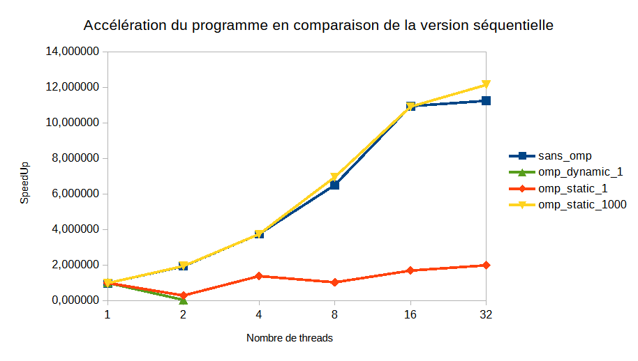

# Compte Rendu des performances du calcul de pi

## Introduction et Méthodologie

### L'Objectif du TP :

L'objectif de ce travail est d'étudier les mécanismes de parallélisation sous OpenMP et d'analyser leur impact sur les performances ici cela s'applique pour le calcul de pi.

1. **Le calcul de Pi :** Un algorithme à charge de travail constante et prévisible. Le calcul exécuté est : $\pi \approx \sum_{i=0}^{N} \frac{4}{1+(i/N)^2} \cdot \frac{1}{N}$. Nous prenons ici 10^8 pour la valeur de N.

Les mesures ont été effectuées sur Grid5000.
Cette contrainte matérielle est importante car les processeurs de Grid5000 possèdent 18 cœurs physiques et 36 threads logiques. C'est pour cela que nous avons pu faire des mesures jusqu'à 32 threads. De plus, la compilation a été réalisée avec gcc (options `-fopenmp` et `-lm`), sans flag d'optimisation agressif tel que `-O3`.

### Méthodologie
Pour chaque version (Séquentielle, Parallélisation manuelle, OpenMP Static/Dynamic), nous avons mesuré le temps d'exécution et calculé le Speedup (temps_sequentiel / temps_parallèle).
L'analyse se concentre sur l'identification des goulots d'étranglement : overhead de gestion des threads, conflits mémoire et répartition de la charge de travail. De plus tous les calculs de temps ont été effectués 3 fois et on a pris la moyenne pour éviter les erreurs de mesures. L'ensemble des valeurs brutes est situé dans le fichier [donnees.ods](donnees.ods).

## Analyse des performances : Calcul de Pi

#### 1. Analyse du séquentiel (1 Thread)

Comme attendu, avec un seul thread, toutes les versions de l'algorithme affichent des performances identiques ou presque. Nous ne constatons pas de surcoût pour les différentes stratégies de parallélisation ce qui est tout à fait normal.

#### 2. Analyse de la version manuelle (par tranches)

Cette version est le calcul de pi par tranche de valeur dans N, le premier thread calcule les valeurs de 0 à N/nb_threads, le second de N/nb_threads à 2N/nb_threads, etc. le dernier thread considère les valeurs de (nb_threads-1)N/nb_threads à N.

Cette version démontre une excellente scalabilité sur les premiers cœurs. Nous obtenons quasiment une augmentation parfaite, frôlant la limite théorique (le speedup est presque égal au nombre de threads) :

* **2 Threads :** Speedup de **1.96**.
* **4 Threads :** Speedup de **3.8**.

Cependant, nous observons un plafonnement de la performance entre 16 et 32 threads, avec un speedup maximal stagnant autour de **(~11x)**. Ce tassement s'explique par la Loi d'Amdahl et des contraintes matérielles :

* **La limite physique :** Le processeur "gros" ne disposant que de 18 cœurs physiques, nous exploitons l'hyper-threading. Ainsi les threads supplémentaires partagent les mêmes unités de calcul et le même cache L1/L2 que les threads principaux. Le gain de performance ne peut donc pas être linéaire sur cette plage.
* **La partie séquentielle incompressible :** Selon la loi d'Amdahl, l'accélération est limitée par la fraction séquentielle du code. Ici, le *merge* final (réduction des sommes partielles) et la gestion mémoire empêchent mathématiquement d'atteindre un speedup de 32, quelle que soit la puissance de la machine.

#### 3. Comparaison des stratégies de scheduling OpenMP

* **Schedule `Dynamic, 1` :**
Les résultats sont très décevants. Le problème est double. D'une part, la granularité est trop fine. D'autre part, cette stratégie est inutile ici car le calcul de Pi présente une charge de travail constante (chaque itération prend exactement le même temps). Le scheduling dynamique est conçu pour l'équilibrage de charge ici ça n'apporte que du surcoût sans aucun bénéfice.
* **Schedule `Static, 1` :**
Malgré l'augmentation des threads, l'efficacité stagne. C'est en très grande partie à cause du False Sharing.
Les variables accumulatrices des threads sont stockées de manière contiguë en mémoire. le problème est que les processeurs gèrent la mémoire par lignes de cache. Si plusieurs threads écrivent sur des variables situées sur la même ligne de cache, les cœurs passent leur temps à invalider mutuellement leurs caches respectifs. Ce trafic inutile annule complètement le gain du parallélisme.
* **Schedule `Static, 1000` avec Réduction :**
C'est la meilleure stratégie, elle rejoint les performances de la version manuelle (**~12x** plus rapide).
* L'utilisation de la clause `reduction` délègue la gestion de la somme finale à OpenMP de manière optimisée.
* Le *chunk* de 1000 espace suffisamment les accès mémoire pour que chaque thread travaille de manière assez indépendante, limitant grandement le False Sharing.
* La répartition est équilibrée : comme la charge est constante, tous les threads terminent quasi simultanément, minimisant le temps d'attente à la barrière de synchronisation finale.

## Conclusion

**Bilan de l'analyse**
L'étude de la parallélisation du calcul de Pi nous permet de mettre en évidence les limites physiques et matérielles du calcul multi-threadé. Pour ce type d'algorithme où la charge de travail est parfaitement constante et prévisible, les stratégies dynamiques sont contre-productives. La clé de la performance réside dans la gestion de la mémoire : il faut absolument éviter le False Sharing en espaçant les accès mémoire (via un chunk de grande taille comme `Static, 1000` ou fonction de N et du nombres de threads) et déléguer les synchronisations critiques à l'API via la clause `reduction`.